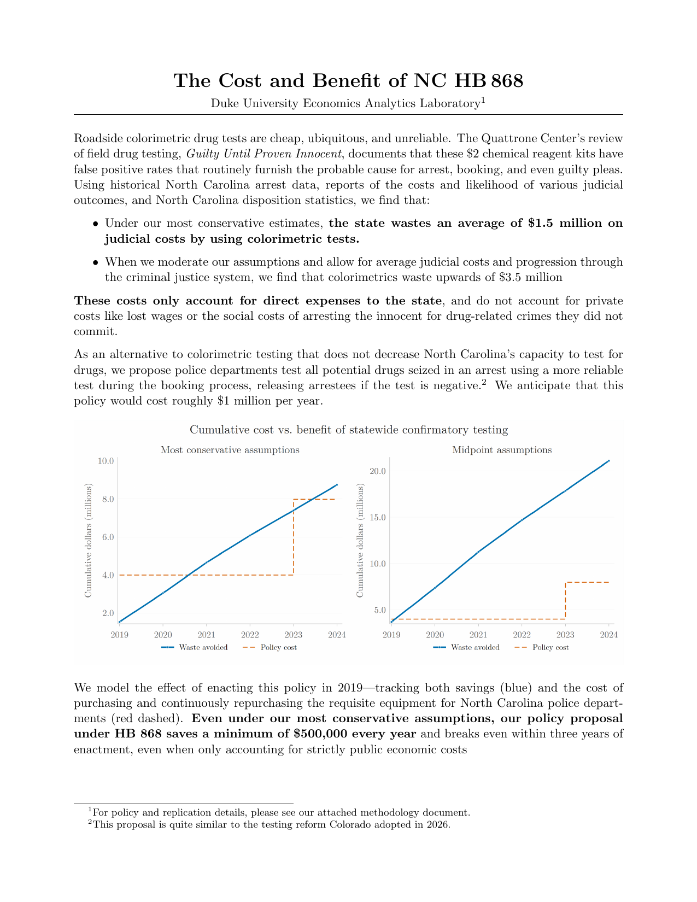

  

  <strong><a href="executive_summary.pdf">📄 Read the full Executive Summary (PDF)</a></strong>
  &nbsp;·&nbsp;
  <a href="methodology.pdf">Methodology &amp; Results (PDF)</a>

---

This GitHub repository contains the results and replication package for Spencer Cooper-Ohm and Jeff DeSimone's cost-benefit analysis of NC HB 868. It is divided into three main components:

* executive\_summary.pdf: a one-page executive summary describing the high level costs and benefits of HB 868.
* methodology.pdf: a more detailed summary of our process, containing information on our data sources, procedures for estimating costs, and a more detailed summary of our results.
* The replication folder: our methodology is fully replicable using publicly available data and our provided do-files. To replicate our analysis:

  1. Follow the directions in data/data\_structure.md to download the publicly available NIBRS data we use.
  2. Open code/00_pipeline.do and set the local directory, then run the script.
  3. The parameters we use are contained in params.do. Edit that file, then run 00_pipeline.do again to see the results of our analysis using customized parameters.

All files were run using Stata 18 SE. Claude Code was used during the coding process, but all files were proofread by a human at least once.

